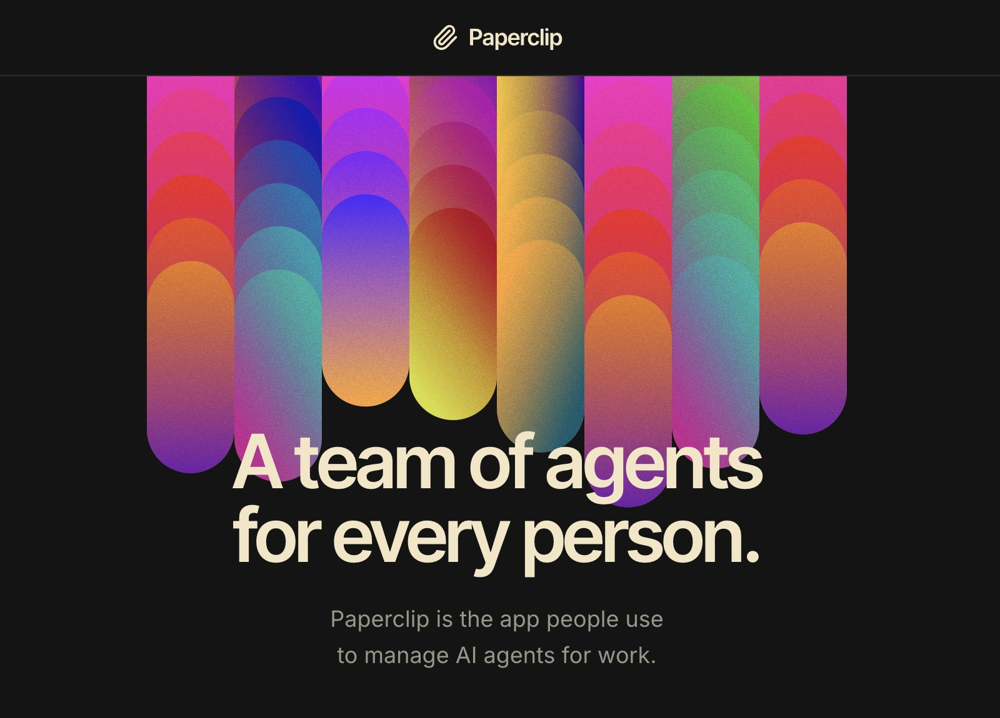

<p align="center">
  
</p>

<p align="center">
  <a href="#quickstart"><strong>Quickstart</strong></a> &middot;
  <a href="https://paperclip.ing/docs"><strong>Docs</strong></a> &middot;
  <a href="https://github.com/paperclipai/paperclip"><strong>GitHub</strong></a> &middot;
  <a href="https://discord.gg/m4HZY7xNG3"><strong>Discord</strong></a> &middot;
  <a href="https://x.com/papercliping"><strong>Twitter</strong></a> &middot;
  <a href="https://paperclip.ing"><strong>Website</strong></a>
</p>

<p align="center">
  <a href="https://github.com/paperclipai/paperclip/blob/master/LICENSE"></a>
  <a href="https://github.com/paperclipai/paperclip/stargazers"></a>
  <a href="https://discord.gg/m4HZY7xNG3"></a>
</p>

<br/>

<div align="center">
  <video src="https://github.com/user-attachments/assets/773bdfb2-6d1e-4e30-8c5f-3487d5b70c8f" width="600" controls></video>
</div>

<br/>

# Paperclip is the app people use to manage AI agents for work.

Open-source orchestration for teams of AI agents.

**If OpenClaw is an _employee_, Paperclip is the _company_.**

Paperclip is a Node.js server and React UI that orchestrates a team of AI agents to run a business. Bring your own agents, assign goals, and track work and costs from one dashboard.

It looks like a task manager. Under the hood: org charts, budgets, governance, goal alignment, and agent coordination.

**Manage business goals, not pull requests.**

|        | Step            | Example                                                            |
| ------ | --------------- | ------------------------------------------------------------------ |
| **01** | Define the goal | _"Build the #1 AI note-taking app to $1M MRR."_                    |
| **02** | Hire the team   | CEO, CTO, engineers, designers, marketers — any bot, any provider. |
| **03** | Approve and run | Review strategy. Set budgets. Hit go. Monitor from the dashboard.  |

<br/>

<div align="center">
<table>
  <tr>
    <td align="center"><strong>Works<br/>with</strong></td>
    <td align="center"><br/><sub>OpenClaw</sub></td>
    <td align="center"><br/><sub>Claude Code</sub></td>
    <td align="center"><br/><sub>Codex</sub></td>
    <td align="center"><br/><sub>Cursor</sub></td>
    <td align="center"><br/><sub>Bash</sub></td>
    <td align="center"><br/><sub>HTTP</sub></td>
  </tr>
</table>

<em>If it can receive a heartbeat, it's hired.</em>

</div>

<br/>

## Paperclip is right for you if

- ✅ You want to build **autonomous AI companies**
- ✅ You **coordinate many different agents** (OpenClaw, Codex, Claude, Cursor) toward a common goal
- ✅ You have **20 simultaneous Claude Code terminals** open and lose track of what everyone is doing
- ✅ You want agents running **autonomously 24/7**, but still want to audit work and chime in when needed
- ✅ You want to **monitor costs** and enforce budgets
- ✅ You want a process for managing agents that **feels like using a task manager**
- ✅ You want to manage your autonomous businesses **from your phone**

<br/>

## Features

<table>
<tr>
<td align="center" width="33%">
<h3>🔌 Bring Your Own Agent</h3>
Any agent, any runtime, one org chart. If it can receive a heartbeat, it's hired.
</td>
<td align="center" width="33%">
<h3>🎯 Goal Alignment</h3>
Every task traces back to the company mission. Agents know <em>what</em> to do and <em>why</em>.
</td>
<td align="center" width="33%">
<h3>💓 Heartbeats</h3>
Agents wake on a schedule, check work, and act. Delegation flows up and down the org chart.
</td>
</tr>
<tr>
<td align="center">
<h3>💰 Cost Control</h3>
Monthly budgets per agent. When they hit the limit, they stop. No runaway costs.
</td>
<td align="center">
<h3>🏢 Multi-Company</h3>
One deployment, many companies. Complete data isolation. One control plane for your portfolio.
</td>
<td align="center">
<h3>🎫 Ticket System</h3>
Every conversation traced. Every decision explained. Full tool-call tracing and immutable audit log.
</td>
</tr>
<tr>
<td align="center">
<h3>🛡️ Governance</h3>
Approve hires, override strategy, pause or terminate any agent — at any time.
</td>
<td align="center">
<h3>📊 Org Chart</h3>
Hierarchies, roles, reporting lines. Your agents have a boss, a title, and a job description.
</td>
<td align="center">
<h3>📱 Mobile Ready</h3>
Monitor and manage your autonomous businesses from anywhere.
</td>
</tr>
</table>

<br/>

## Problems Paperclip solves

| Without Paperclip                                                                                                                     | With Paperclip                                                                                                                         |
| ------------------------------------------------------------------------------------------------------------------------------------- | -------------------------------------------------------------------------------------------------------------------------------------- |
| ❌ You have 20 Claude Code tabs open and can't track which one does what. On reboot you lose everything.                              | ✅ Tasks are ticket-based, conversations are threaded, sessions persist across reboots.                                                |
| ❌ You manually gather context from several places to remind your bot what you're actually doing.                                     | ✅ Context flows from the task up through the project and company goals — your agent always knows what to do and why.                  |
| ❌ Folders of agent configs are disorganized and you're re-inventing task management, communication, and coordination between agents. | ✅ Paperclip gives you org charts, ticketing, delegation, and governance out of the box — so you run a company, not a pile of scripts. |
| ❌ Runaway loops waste hundreds of dollars of tokens and max your quota before you even know what happened.                           | ✅ Cost tracking surfaces token budgets and throttles agents when they're out. Management prioritizes with budgets.                    |
| ❌ You have recurring jobs (customer support, social, reports) and have to remember to manually kick them off.                        | ✅ Heartbeats handle regular work on a schedule. Management supervises.                                                                |
| ❌ You have an idea, you have to find your repo, fire up Claude Code, keep a tab open, and babysit it.                                | ✅ Add a task in Paperclip. Your coding agent works on it until it's done. Management reviews their work.                              |

<br/>

## Why Paperclip is special

Paperclip handles the hard orchestration details correctly.

|                                   |                                                                                                               |
| --------------------------------- | ------------------------------------------------------------------------------------------------------------- |
| **Atomic execution.**             | Task checkout and budget enforcement are atomic, so no double-work and no runaway spend.                      |
| **Persistent agent state.**       | Agents resume the same task context across heartbeats instead of restarting from scratch.                     |
| **Runtime skill injection.**      | Agents can learn Paperclip workflows and project context at runtime, without retraining.                      |
| **Governance with rollback.**     | Approval gates are enforced, config changes are revisioned, and bad changes can be rolled back safely.        |
| **Goal-aware execution.**         | Tasks carry full goal ancestry so agents consistently see the "why," not just a title.                        |
| **Portable company templates.**   | Export/import orgs, agents, and skills with secret scrubbing and collision handling.                          |
| **True multi-company isolation.** | Every entity is company-scoped, so one deployment can run many companies with separate data and audit trails. |

<br/>

## What's Under the Hood

Paperclip is a full control plane, not a wrapper. Before you build any of this yourself, know that it already exists:

```
┌──────────────────────────────────────────────────────────────┐
│                       PAPERCLIP SERVER                       │
│                                                              │
│  ┌───────────┐  ┌───────────┐  ┌───────────┐  ┌───────────┐  │
│  │Identity & │  │  Work &   │  │ Heartbeat │  │Governance │  │
│  │  Access   │  │   Tasks   │  │ Execution │  │& Approvals│  │
│  └───────────┘  └───────────┘  └───────────┘  └───────────┘  │
│                                                              │
│  ┌───────────┐  ┌───────────┐  ┌───────────┐  ┌───────────┐  │
│  │ Org Chart │  │Workspaces │  │  Plugins  │  │  Budget   │  │
│  │ & Agents  │  │ & Runtime │  │           │  │ & Costs   │  │
│  └───────────┘  └───────────┘  └───────────┘  └───────────┘  │
│                                                              │
│  ┌───────────┐  ┌───────────┐  ┌───────────┐  ┌───────────┐  │
│  │ Routines  │  │ Secrets & │  │ Activity  │  │  Company  │  │
│  │& Schedules│  │  Storage  │  │ & Events  │  │Portability│  │
│  └───────────┘  └───────────┘  └───────────┘  └───────────┘  │
└──────────────────────────────────────────────────────────────┘
         ▲              ▲              ▲              ▲
   ┌─────┴─────┐  ┌─────┴─────┐  ┌─────┴─────┐  ┌─────┴─────┐
   │  Claude   │  │   Codex   │  │   CLI     │  │ HTTP/web  │
   │   Code    │  │           │  │  agents   │  │   bots    │
   └───────────┘  └───────────┘  └───────────┘  └───────────┘
```

### The Systems

<table>
<tr>
<td width="50%">

**Identity & Access** — Two deployment modes (trusted local or authenticated), board users, agent API keys, short-lived run JWTs, company memberships, invite flows, and OpenClaw onboarding. Every mutating request is traced to an actor.

</td>
<td width="50%">

**Org Chart & Agents** — Agents have roles, titles, reporting lines, permissions, and budgets. Adapter examples match the diagram: Claude Code, Codex, CLI agents such as Cursor/Gemini/bash, HTTP/webhook bots such as OpenClaw, and external adapter plugins. If it can receive a heartbeat, it's hired.

</td>
</tr>
<tr>
<td>

**Work & Task System** — Issues carry company/project/goal/parent links, atomic checkout with execution locks, first-class blocker dependencies, comments, documents, attachments, work products, labels, and inbox state. No double-work, no lost context.

</td>
<td>

**Heartbeat Execution** — DB-backed wakeup queue with coalescing, budget checks, workspace resolution, secret injection, skill loading, and adapter invocation. Runs produce structured logs, cost events, session state, and audit trails. Recovery handles orphaned runs automatically.

</td>
</tr>
<tr>
<td>

**Workspaces & Runtime** — Project workspaces, isolated execution workspaces (git worktrees, operator branches), and runtime services (dev servers, preview URLs). Agents work in the right directory with the right context every time.

</td>
<td>

**Governance & Approvals** — Board approval workflows, execution policies with review/approval stages, decision tracking, budget hard-stops, agent pause/resume/terminate, and full audit logging. Nothing ships without your sign-off.

</td>
</tr>
<tr>
<td>

**Budget & Cost Control** — Token and cost tracking by company, agent, project, goal, issue, provider, and model. Scoped budget policies with warning thresholds and hard stops. Overspend pauses agents and cancels queued work automatically.

</td>
<td>

**Routines & Schedules** — Recurring tasks with cron, webhook, and API triggers. Concurrency and catch-up policies. Each routine execution creates a tracked issue and wakes the assigned agent — no manual kick-offs needed.

</td>
</tr>
<tr>
<td>

**Plugins** — Instance-wide plugin system with out-of-process workers, capability-gated host services, job scheduling, tool exposure, and UI contributions. Extend Paperclip without forking it.

</td>
<td>

**Secrets & Storage** — Instance and company secrets, encrypted local storage, provider-backed object storage, attachments, and work products. Sensitive values stay out of prompts unless a scoped run explicitly needs them.

</td>
</tr>
<tr>
<td>

**Activity & Events** — Mutating actions, heartbeat state changes, cost events, approvals, comments, and work products are recorded as durable activity so operators can audit what happened and why.

</td>
<td>

**Company Portability** — Export and import entire organizations — agents, skills, projects, routines, and issues — with secret scrubbing and collision handling. One deployment, many companies, complete data isolation.

</td>
</tr>
</table>

<br/>

## What Paperclip is not

|                              |                                                                                                                      |
| ---------------------------- | -------------------------------------------------------------------------------------------------------------------- |
| **Not a chatbot.**           | Agents have jobs, not chat windows.                                                                                  |
| **Not an agent framework.**  | We don't tell you how to build agents. We tell you how to run a company made of them.                                |
| **Not a workflow builder.**  | No drag-and-drop pipelines. Paperclip models companies — with org charts, goals, budgets, and governance.            |
| **Not a prompt manager.**    | Agents bring their own prompts, models, and runtimes. Paperclip manages the organization they work in.               |
| **Not a single-agent tool.** | This is for teams. If you have one agent, you probably don't need Paperclip. If you have twenty — you definitely do. |
| **Not a code review tool.**  | Paperclip orchestrates work, not pull requests. Bring your own review process.                                       |

<br/>

## Quickstart

Open source. Self-hosted. No Paperclip account required.

```bash
npx paperclipai onboard --yes
```

> **Troubleshooting: private npm registry `.npmrc`**
>
> If this fails with an `E404` for `paperclipai` (or similar) and you use a private npm registry (for example GitHub Packages) via a global `~/.npmrc`, `npx` may be resolving `paperclipai` against that private registry instead of the public npm registry.
>
> Diagnostic:
>
> ```bash
> npm config get registry
> ```
>
> Workaround (cross-platform; force the public npm registry for this command):
>
> ```bash
> npx --registry https://registry.npmjs.org paperclipai onboard --yes
> ```

That quickstart path now defaults to trusted local loopback mode for the fastest first run. To start in authenticated/private mode instead, choose a bind preset explicitly:

```bash
npx paperclipai onboard --yes --bind lan
# or:
npx paperclipai onboard --yes --bind tailnet
```

If you already have Paperclip configured, rerunning `onboard` keeps the existing config in place. Use `paperclipai configure` to edit settings.

Or manually:

```bash
git clone https://github.com/paperclipai/paperclip.git
cd paperclip
pnpm install
pnpm dev
```

This starts the API server at `http://localhost:3100`. An embedded PostgreSQL database is created automatically — no setup required.

> **Requirements:** Node.js 20+, pnpm 9.15+

<br/>

## FAQ

**What does a typical setup look like?**
Locally, a single Node.js process manages an embedded Postgres and local file storage. For production, point it at your own Postgres and deploy however you like. Configure projects, agents, and goals — the agents take care of the rest.

If you're a solo entrepreneur you can use Tailscale to access Paperclip on the go. Then later you can deploy to e.g. Vercel when you need it.

**Can I run multiple companies?**
Yes. A single deployment can run an unlimited number of companies with complete data isolation.

**How is Paperclip different from agents like OpenClaw or Claude Code?**
Paperclip _uses_ those agents. It orchestrates them into a company — with org charts, budgets, goals, governance, and accountability.

**Why should I use Paperclip instead of just pointing my OpenClaw to Asana or Trello?**
Agent orchestration has subtleties in how you coordinate who has work checked out, how to maintain sessions, monitoring costs, establishing governance - Paperclip does this for you.

(Bring-your-own-ticket-system is on the Roadmap)

**Do agents run continuously?**
By default, agents run on scheduled heartbeats and event-based triggers (task assignment, @-mentions). You can also hook in continuous agents like OpenClaw. You bring your agent and Paperclip coordinates.

<br/>

## Development

```bash
pnpm dev              # Full dev (API + UI, watch mode)
pnpm dev:once         # Full dev without file watching
pnpm dev:server       # Server only
pnpm build            # Build all
pnpm typecheck        # Type checking
pnpm test             # Cheap default test run (Vitest only)
pnpm test:watch       # Vitest watch mode
pnpm test:e2e         # Playwright browser suite
pnpm db:generate      # Generate DB migration
pnpm db:migrate       # Apply migrations
```

`pnpm test` does not run Playwright. Browser suites stay separate and are typically run only when working on those flows or in CI.

See [doc/DEVELOPING.md](doc/DEVELOPING.md) for the full development guide.

<br/>

## Roadmap

- ✅ Plugin system (e.g. add a knowledge base, custom tracing, queues, etc)
- ✅ Get OpenClaw / claw-style agent employees
- ✅ companies.sh - import and export entire organizations
- ✅ Easy AGENTS.md configurations
- ✅ Skills Manager
- ✅ Scheduled Routines
- ✅ Better Budgeting
- ✅ Agent Reviews and Approvals
- ✅ Multiple Human Users
- ⚪ Cloud / Sandbox agents (e.g. Cursor / e2b / Novita agents)
- ⚪ Artifacts & Work Products
- ⚪ Memory / Knowledge
- ⚪ Enforced Outcomes
- ⚪ MAXIMIZER MODE
- ⚪ Deep Planning
- ⚪ Work Queues
- ⚪ Self-Organization
- ⚪ Automatic Organizational Learning
- ⚪ CEO Chat
- ⚪ Cloud deployments
- ⚪ Desktop App

This is the short roadmap preview. See the full roadmap in [ROADMAP.md](ROADMAP.md).

<br/>

## Community & Plugins

Find Plugins and more at [awesome-paperclip](https://github.com/gsxdsm/awesome-paperclip)

## Observability

Paperclip ships with opt-in OpenTelemetry auto-instrumentation for the server (traces only). It activates when `OTEL_EXPORTER_OTLP_ENDPOINT` is set and supports `grpc`, `http/protobuf`, and `http/json` via the standard `OTEL_EXPORTER_OTLP_PROTOCOL` env var. The `@opentelemetry/*` packages are optional peer dependencies — install them only if you want tracing. See [doc/observability.md](doc/observability.md) for install commands and the full env-var reference.

## Telemetry

Paperclip collects anonymous usage telemetry to help us understand how the product is used and improve it. No personal information, issue content, prompts, file paths, or secrets are ever collected. Private repository references are hashed with a per-install salt before being sent.

Telemetry is **enabled by default** and can be disabled with any of the following:

| Method               | How                                                     |
| -------------------- | ------------------------------------------------------- |
| Environment variable | `PAPERCLIP_TELEMETRY_DISABLED=1`                        |
| Standard convention  | `DO_NOT_TRACK=1`                                        |
| CI environments      | Automatically disabled when `CI=true`                   |
| Config file          | Set `telemetry.enabled: false` in your Paperclip config |

## Contributing

We welcome contributions. See the [contributing guide](CONTRIBUTING.md) for details.

<br/>

## Community

- [Discord](https://discord.gg/m4HZY7xNG3) — Join the community
- [Twitter / X](https://x.com/papercliping) — Follow updates and announcements
- [GitHub Issues](https://github.com/paperclipai/paperclip/issues) — bugs and feature requests
- [GitHub Discussions](https://github.com/paperclipai/paperclip/discussions) — ideas and RFC

<br/>

## License

MIT &copy; 2026 [Paperclip Labs, Inc](https://paperclip.ing)

## Star History

[](https://www.star-history.com/?repos=paperclipai%2Fpaperclip&type=date&legend=top-left)

<br/>

---

<p align="center">
  <sub>Open source under MIT. Built for people who want to get work done, not babysit agents.</sub>
</p>

---

## Moving this instance to another Mac (self-hosted transfer)

> This section documents how **this fork's** self-hosted deployment is moved between Macs
> without losing any state. It applies to a laptop-hosted instance served over Tailscale and
> managed by the `ops/deploy.sh` blue-green pipeline. English first, 繁體中文 below.

### What moves vs. what rebuilds

- **Moves (all state, ~1 GB):** `~/.paperclip/instances/default` — every agent, company, task,
  the embedded Postgres database, per-agent Asana tokens, **and the secrets `.env`** that lives
  inside it (`GOOGLE_CLIENT_ID/SECRET`, `BETTER_AUTH_SECRET`, `PAPERCLIP_AGENT_JWT_SECRET`). The
  server loads that `.env` from a fixed path on every boot, so it travels with the instance dir.
  The launchd service definition (`~/Library/LaunchAgents/com.seasonarts.paperclip.plist`) moves too.
- **Rebuilds (never copied):** the code and its `node_modules` / `ui/dist`. The new Mac clones the
  repo and rebuilds fresh via `ops/deploy.sh setup`. (Don't copy `~/paperclip/releases` — it's
  many GB of regenerable build output.)

Both machines are Apple Silicon (arm64), so the embedded Postgres data and native modules are
binary-compatible.

### ⚠️ The one thing that isn't automatic: the public URL

A new Mac is a new Tailscale device with a **new `*.ts.net` hostname**, so the public URL changes.
Because the app uses Google SSO, you must update, on the new Mac:

1. `~/.paperclip/instances/default/.env` → `PAPERCLIP_AUTH_PUBLIC_BASE_URL` and `PAPERCLIP_ALLOWED_HOSTNAMES`
2. Google Cloud Console → the OAuth client → add the new host's redirect URI
3. Tell users the temporary URL (their bookmarks change)

`BETTER_AUTH_SECRET` and `PAPERCLIP_AGENT_JWT_SECRET` must stay identical (copying the instance
`.env` handles this) so existing sessions and agent JWTs remain valid.

### Steps

**On the OLD Mac** — package everything into one archive (briefly stops the service to snapshot the
DB consistently, then restarts it so this Mac keeps serving until the new one is verified):

```bash
ops/migrate-to-new-mac.sh          # → ~/paperclip-migrate-<date>.tgz
```

Copy that `.tgz` to the new Mac (AirDrop / scp / Tailscale).

**On the NEW Mac (M2)** — install tooling once, then restore:

```bash
# one-time tooling
brew install node pnpm git
# + install the Tailscale app and the Claude CLI, then:
ln -sf ~/.local/bin/claude /opt/homebrew/bin/claude   # so agents can spawn `claude`

# restore state + code (does the mechanical restore, prints the manual steps)
ops/restore-on-new-mac.sh ~/paperclip-migrate-<date>.tgz
```

Then do the two manual steps it prints (Tailscale funnel + the URL/OAuth update), and start it:

```bash
cd <repo> && ops/deploy.sh setup <branch>
```

**Verify:** the site loads over the new funnel · Google login works · an agent run succeeds
(`claude` resolves on the launchd PATH) · calendar + skills render.

**Once the new Mac is confirmed good,** stop the old one:

```bash
launchctl bootout gui/$(id -u)/com.seasonarts.paperclip
```

### Rollback / safety

- The old Mac keeps running until you stop it — if the new Mac has trouble, you lose nothing.
- On the new Mac, `restore-on-new-mac.sh` backs up any pre-existing instance dir to
  `~/.paperclip/instances/default.bak-<ts>` before restoring.
- `ops/deploy.sh` builds + health-checks in isolation and auto-rolls-back the code; the DB you've
  already carried over intact.

---

## 將此實例搬移到另一台 Mac（自架轉移）

> 本節說明如何在不遺失任何狀態的前提下，把**本 fork** 的自架部署從一台 Mac 搬到另一台。適用於以
> 筆電自架、透過 Tailscale 對外服務、並以 `ops/deploy.sh` 藍綠部署管線管理的實例。（上為英文，下為繁體中文。）

### 哪些要搬、哪些重建

- **要搬（全部狀態，約 1 GB）：** `~/.paperclip/instances/default`——所有代理、公司、任務、內嵌
  Postgres 資料庫、各代理的 Asana token，**以及其中的機密 `.env`**（`GOOGLE_CLIENT_ID/SECRET`、
  `BETTER_AUTH_SECRET`、`PAPERCLIP_AGENT_JWT_SECRET`）。伺服器每次啟動都從固定路徑載入該 `.env`，
  因此它會隨實例資料夾一起搬移。launchd 服務定義
  （`~/Library/LaunchAgents/com.seasonarts.paperclip.plist`）也要搬。
- **重建（絕不複製）：** 程式碼與其 `node_modules` / `ui/dist`。新 Mac 會 clone 倉庫並以
  `ops/deploy.sh setup` 重新建置。（不要複製 `~/paperclip/releases`——那是好幾 GB、可重新產生的建置產物。）

兩台都是 Apple Silicon（arm64），因此內嵌 Postgres 資料與原生模組二進位相容。

### ⚠️ 唯一無法自動化的部分：對外網址

新 Mac 是新的 Tailscale 裝置，會有**新的 `*.ts.net` 主機名**，對外網址因此改變。由於本 App 使用
Google 單一登入（SSO），你必須在新 Mac 上更新：

1. `~/.paperclip/instances/default/.env` → `PAPERCLIP_AUTH_PUBLIC_BASE_URL` 與 `PAPERCLIP_ALLOWED_HOSTNAMES`
2. Google Cloud Console → OAuth 用戶端 → 新增新主機名的 redirect URI
3. 告知使用者臨時網址（他們的書籤會改變）

`BETTER_AUTH_SECRET` 與 `PAPERCLIP_AGENT_JWT_SECRET` 必須保持一致（複製實例 `.env` 即可），
既有的登入工作階段與代理 JWT 才會繼續有效。

### 步驟

**在舊 Mac** ——把所有東西打包成單一封存檔（會短暫停止服務以取得一致的資料庫快照，然後重新啟動，
讓這台在新機驗證完成前持續服務）：

```bash
ops/migrate-to-new-mac.sh          # → ~/paperclip-migrate-<日期>.tgz
```

把該 `.tgz` 傳到新 Mac（AirDrop／scp／Tailscale）。

**在新 Mac（M2）** ——先安裝一次性工具，再還原：

```bash
# 一次性工具
brew install node pnpm git
# 另外安裝 Tailscale App 與 Claude CLI，然後：
ln -sf ~/.local/bin/claude /opt/homebrew/bin/claude   # 讓代理能啟動 `claude`

# 還原狀態與程式碼（自動完成機械式還原，並印出手動步驟）
ops/restore-on-new-mac.sh ~/paperclip-migrate-<日期>.tgz
```

接著完成它印出的兩個手動步驟（Tailscale funnel ＋ 網址／OAuth 更新），再啟動：

```bash
cd <倉庫> && ops/deploy.sh setup <分支>
```

**驗證：** 網站可透過新的 funnel 載入 · Google 登入正常 · 代理執行成功
（launchd 的 PATH 找得到 `claude`）· 行事曆與技能正常顯示。

**確認新 Mac 一切正常後**，再停止舊的：

```bash
launchctl bootout gui/$(id -u)/com.seasonarts.paperclip
```

### 回復／安全性

- 舊 Mac 在你手動停止前會持續運行——新 Mac 若有問題，不會損失任何東西。
- 在新 Mac 上，`restore-on-new-mac.sh` 會先把既有的實例資料夾備份到
  `~/.paperclip/instances/default.bak-<時間戳>` 再還原。
- `ops/deploy.sh` 會在隔離環境中建置並健康檢查，程式碼可自動回復；資料庫你已完整搬移。
