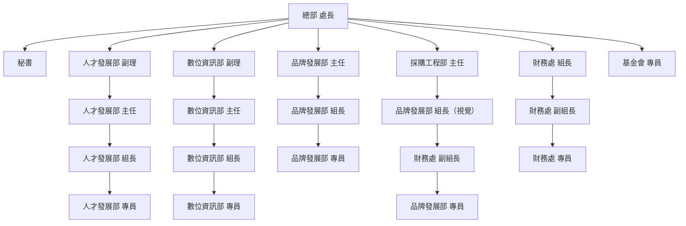
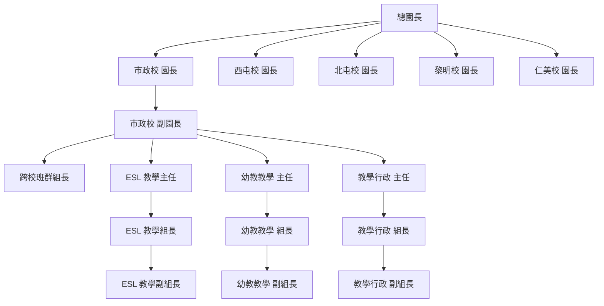

# 四季藝術 · AI 代理人組織圖（校區優先 / reportsTo）

用途：AI 代理人建置時的**回報線唯一事實來源**。每支 agent 的 `reportsTo`、`title`、
`metadata.teams`（校區＋組）依此設定。回報線通則：所有「上呈核准」對象＝**直接主管＝週誌主簽者**。

## 層級模型（Levels）

| Level | 內容 | 同層平行？ |
|---|---|---|
| **L0** | 創辦人（唐富美） | — |
| **L1** | 校區：仁美 / 市政 / 西屯 / 黎明 / 北屯 / 總管理處 | ✅ |
| **L2** | 校區首長：統籌總園長 → 園長 / 副園長；**總管理處＝處長（直接對創辦人）** | — |
| **L3** | 組（teams）：幼教學組・外師教學組・ESL教學組・註冊組・總務管理組（**仁美另有跨校巡輔**）；總管理處＝各部門 | ✅ |
| **L4** | 組內主管／組長：**教學主管 ＝ 跨校巡輔組長**・活動主管・外師組長・ESL教學主管・ESL行政・註冊組長・幼教行政・總務組長 | ✅ |
| **L5** | 組員：教師 / 外師 / 註冊組員 / 行政組員… | ✅ |

- **跨校巡輔組長（不帶班・跨校）＝ L4，與教學主管同級**，回報園長／副園長（非總園長直屬）。
- **校護：已移除**，不建代理。
- **跨校巡輔**目前僅設於**仁美**校（其他校暫不設；未來要擴校再加）。

## 階層樹

```
創辦人（唐富美）
├── 仁美校    〔統籌總園長 吳家秀（兼園長）｜副園長 王姿雅〕
│   └── L3 組：幼教學組 · 跨校巡輔 · 外師教學組 · ESL教學組 · 註冊組 · 總務管理組
├── 市政校    〔統籌總園長 哈曉如｜副園長 賴慕儀〕
│   └── L3 組：幼教學組 · 外師教學組 · ESL教學組 · 註冊組 · 總務管理組
├── 西屯校    〔總園長兼園長 哈曉如・直接管轄（無副園長）〕
│   └── L3 組：幼教學組 · 外師教學組 · ESL教學組 · 註冊組 · 總務管理組
├── 黎明校    〔統籌總園長 哈曉如｜副園長 許紋華〕
│   └── L3 組：幼教學組 · 外師教學組 · ESL教學組 · 註冊組 · 總務管理組
├── 北屯校    〔統籌總園長 吳家秀｜園長 詹心儀〕
│   └── L3 組：幼教學組 · 外師教學組 · ESL教學組 · 註冊組 · 總務管理組
└── 總管理處      〔處長 張廖心淑・直接對創辦人；人發直屬創辦人〕
    └── L3 部門：數位資訊部 · 人才發展部 · 品牌發展部 · 基金會 · 採購工程部 · 財務部 · 餐飲部
```

## 各組的 L4 主管 → L5 組員（校區通用）

| 組 (L3) | L4 主管／組長 | L5 組員 |
|---|---|---|
| 幼教學組 | 教學主管、活動主管、幼教行政 | 教師 |
| 跨校巡輔（僅仁美） | 跨校巡輔組長（≡教學主管級） | — |
| 外師教學組 | 外師組長 | 外師 |
| ESL教學組 | ESL教學主管、ESL行政 | ESL組員 |
| 註冊組 | 註冊組長 | 註冊組員 |
| 總務管理組 | 總務組長 | 組員〔校護已移除〕 |

## 校區首長對照（L2）

| 校區 | 統籌總園長 | 園長 / 副園長 |
|---|---|---|
| 仁美 | 吳家秀（兼園長） | 副園長 王姿雅 |
| 市政 | 哈曉如 | 副園長 賴慕儀 |
| 西屯 | 哈曉如（兼園長・直接管轄） | — |
| 黎明 | 哈曉如 | 副園長 許紋華 |
| 北屯 | 吳家秀 | 園長 詹心儀 |
| 總管理處 | — | 處長 張廖心淑（直接對創辦人） |

## reportsTo 規則
`組員(L5) → 組長/主管(L4) → 副園長→園長(L2) → 統籌總園長 → 創辦人(L0)`。
- 無副園長的校（西屯）：L4 → 園長（兼總園長）→ 創辦人。
- 總管理處：組員/組長 → 部門主管 → 處長 → 創辦人（人發直屬創辦人）。
- 跨校巡輔組長 → 園長/副園長（同教學主管線）。
- **統籌分工**：哈曉如（哈哈）統籌 **市政・西屯・黎明**；吳家秀（家秀）統籌 **仁美・北屯**。校首長（園長/副園長）的 reportsTo ＝ 其校區的統籌總園長。
- **家秀生產期間（115.07 中起）**：仁美、北屯兩校日常由副園長 **王姿雅（雅雅）** 代理。北屯園長 詹心儀 的 reportsTo 暫掛 **雅雅**（代理線）；**家秀**仍為仁美・北屯統籌，家秀回任後回復。
- **跨校輔導可見度（`metadata.teams`）**：授權採「team 任一相符」，統籌／輔導者的 teams 需含其統籌的每個校區才看得到該校專案。因此 **哈曉如（哈哈）teams ＝ 西屯＋市政＋黎明**；**家秀、雅雅 teams ＝（園長團隊＋總園長/園長）＋仁美＋北屯**。第一個 team 仍為分群用的主校區／園長團隊。

## 總管理處部門細節（L3 → 子組）
- 數位資訊部（陳偉誠 副理）：資訊MIS組（黃坤源）／軟體組（張育銘）
- 人才發展部（何惠君 副理）：梁婉珣 主任（人資・飛騰・勞資）→ 招募人事行政／訓練發展／外師人事
- 品牌發展部（處長／Una 代管）：行銷企劃／攝影／數位行銷／視覺設計・商品開發
- 基金會（Una 代管）
- 採購工程部（吳佩容 組長）
- 財務部（張廖心淑 代理）
- 餐飲部（四季走走・游雅筑 主任）

## 創辦人層級模型（2026-09-01 唐老師定版）

唐老師理解的層級，兩條線：

```
校區線   總園長 ▸ 園長 ▸ 幼教／ESL／教學行政 主任 ▸ 幼教／ESL／教學行政 組長 ▸ 幼教／ESL／教學行政 組員
總部線   處長 ▸ 總部各單位主管 ▸ 總部各單位組員
```

與上方 L0–L5 是同一件事的兩種說法：L2＝總園長/園長（總部＝處長）、L4＝主任/組長（總部＝各單位主管）、L5＝組員。
**主任 與 組長 是兩層**，不可壓成一層——主任帶組長，組長帶組員。

### 園長團隊（`metadata.teams[0]`）

`領導團隊` 已於 2026-09-01 更名為 **`園長團隊`**，其下不再放校區，改放**職級**三組：

| 子團隊 | 成員 |
|---|---|
| `總園長` | 哈曉如（哈哈）、吳家秀（家秀） |
| `園長` | 詹心儀（北屯園長）、賴慕儀（市政副園長）、許紋華（黎明副園長）、王姿雅（仁美副園長） |
| `處長` | 張廖心淑 |

校區 token（仁美／市政／…）仍留在同一個 `teams` 陣列的後面，因為可見度是「任一 token 相符」——
分群看 `teams[0]`／`teams[1]`，授權看整個陣列。創辦人與跨校家長溝通代理人留在 `園長團隊` 底下、不掛職級。

> 舊 token `領導團隊` 仍可用：`packages/shared/src/team-tokens.ts` 會把它正規化到 `園長團隊`，
> 既有的技能／資料夾分享不會失效。

## 詳細組織圖（唐老師提供・2026-09-01）

### 一、總部（總管理處）



### 二、校區



> 市政校畫出完整的一條線作為範本；其餘四校同構（西屯無副園長，L4 直接掛園長）。

## 待補：總管理處職位（2026-09-01）

Paperclip 先前沒有 **人發／行銷／視覺／採購** 的職位選項，HQ 進用只能借用校區職稱。
現已補進 `ui/src/lib/org-chart-options.ts` 的 `POSITIONS`，各職務的職掌／三段見
`doc/roles/`（每個職位一個檔）與 `skills/sa-agent-onboarding/SKILL.md` 五B。
